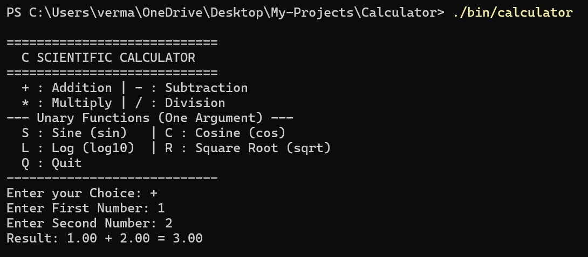

# C Console Calculator

A simple command-line calculator built in C as a mini-project. It supports addition, subtraction, multiplication, and division.

## 🚀 Live Preview



***

## Project Structure

This project follows a standard C layout:
- `include/`: Contains public header files (`.h`).
- `src/`: Contains C source files (`.c`).
- `bin/`: Contains the compiled executable and object files.

## Build and Run Instructions

1.  **Navigate to the project directory:**
    ```bash
    cd Calculator_C
    ```
2.  **Compile the code using the Makefile:**
    ```bash
    make all
    ```
    (This will use GCC to compile `main.c` and `calculator_operations.c` and link them into an executable.)
3.  **Run the calculator:**
    ```bash
    ./bin/calculator
    ```
4.  **To clean up the compiled files:**
    ```bash
    make clean
    ```